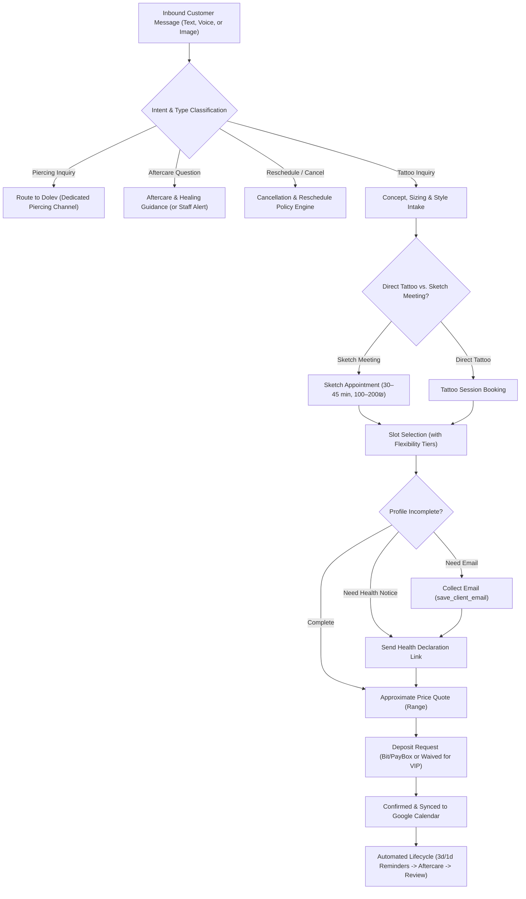

# Inkmind — Customer Conversation Flows & Real-World Edge Cases

This document defines the production conversation flows, edge cases, and behavioral scripts for the Inkmind front-facing AI agent, synthesized from real WhatsApp studio conversations (`reference-conversations.md`) and operational requirements (`requirements-notes.md`).

---

## High-Level State & Flow Architecture

---

## 1. Edge Case: Sketch Meeting First (פגישת סקיצה מקדימה)
*Based on Conversations 1, 2, 4, 5.*

### Context:
Clients with large pieces (half-sleeve, leg sleeve), cover-ups, or who want to sit with the artist before the needle touches the skin. The sketch meeting costs 100–200₪, which is credited toward the final tattoo.

### Script / Flow:
> **Customer**: "היי, אני רוצה לעשות חצי שרוול על הרגל אבל אין לי סקיצה מוכנה, אני רוצה לשבת עם דור ולעצב יחד"  
> **Bot**: "היי! בשביל פרויקט כזה של חצי שרוול הכי מומלץ שנקבע קודם פגישת סקיצה מסודרת עם דור בסטודיו.  
> תשבו יחד, תמדדו את הרגל ותבנו סקיצה מותאמת אישית בדיוק למה שאתה אוהב 🙌  
> עלות הפגישה היא 100₪ (או 200₪ לפרויקטים גדולים במיוחד) שמתקזזים לך במלואם מהמחיר של הקעקוע.  
> מתי בערך נוח לך להגיע — בקרים או אחה״צ?"  
> **Customer**: "עדיף לי אחה״צ באחד מימי שלישי או חמישי"  
> *(Bot checks availability for sketch meeting duration: 45 min)*  
> **Bot**: "יש לדור משבצת פנויה לפגישת סקיצה ביום חמישי 23/10 בשעה 16:30, או בשלישי 28/10 ב-17:00. מה מתאים לך?"  
> **Customer**: "חמישי 16:30 מעולה"  
> **Bot**: "סגור, שריינתי לך פגישת סקיצה עם דור ליום חמישי 23/10 ב-16:30! ✨  
> *(Proceeds to email & Template D confirmation)*"

---

## 2. Edge Case: Vague Concept & Sizing Clarification (רעיון מעורפל)
*Based on Conversation 2.*

### Context:
The client says: "אני רוצה קעקוע של מזל טלה, לא מפלצתי". Without reference images, placement, or rough dimensions, the studio cannot price or allocate calendar time (a 5cm line-art ram takes 45 mins; a realistic shaded ram takes 4 hours).

### Rule:
The bot **must not guess or hallucinate a duration**. It gently guides the customer to provide rough placement, size (in cm or relative to body part like "1/3 forearm"), or send reference style images.

### Script / Flow:
> **Customer**: "אני רוצה לעשות משהו שקשור למזל טלה, לא משהו מפלצתי אבל יפה"  
> **Bot**: "רעיון אש! מזל טלה אפשר לקחת לכיוון של קו עדין ומינימליסטי, או ריאליזם עם הצללות, ויש הבדל משמעותי בזמן העבודה ביניהם.  
> באיזה אזור בגוף חשבת לעשות ובאיזה סדר גודל (למשל 10 ס״מ, שליש אמה, או משהו אחר)?  
> אם יש לך תמונות השראה שאהבת בגוגל או בפינטרסט – תרגיש חופשי להעיף לכאן!"  
> **Customer**: [שולח תמונה של קווי מתאר עדינים של אייל] "משהו כזה על האמה הפנימית, בערך 8-10 ס״מ"  
> **Bot**: "יושב מושלם! סגנון כזה של קווים נקיים לוקח סביב שעה וחצי. טווח המחירים לקעקוע כזה הוא בערך 500–700₪ (המחיר הסופי נקבע בזמן אמת לפי המידה והסקיצה המדויקת שנניח עליך בסטודיו).  
> נבדוק תאריכים קרובים?"

---

## 3. Edge Case: Minor / Under-18 Client (לקוח קטין גיל 16–18)
*Based on Conversation 4 & Israeli Studio Regulations.*

### Legal & Studio Policy:
- Under 16: Strict refusal.
- 16 to 18: Permitted **only** with physical in-person parental presence or notarized/signed parental consent form + ID photocopy (ספח תעודת זהות).

### Script / Flow:
> **Customer**: "היי קוראים לי דניאל, אני בן 17 ורוצה לקבוע קעקוע ראשון"  
> **Bot**: "אהלן דניאל! מזל טוב על הקעקוע הראשון 🙌  
> שימו לב שמכיוון שאתה בן 17, לפי הנהלים בסטודיו ולפי החוק חובה להגיע עם אחד ההורים לחתימה על טופס הסכמה במקום (או להצטייד מראש באישור הורים חתום בצירוף ספח תעודת זהות).  
> זה מסתדר לך? אם כן, ספר לנו איזה קעקוע תרצה לעשות!"

---

## 4. Edge Case: Multi-Person / Group Booking (תור קבוצתי / חברים)
*Based on Conversation 5.*

### Context:
Two or three friends want to come together on the same day (e.g. matching tattoos, or consecutive sketch sessions).

### Script / Flow:
> **Customer**: "מה הולך, אנחנו רוצים לקבוע סקיצות ל-3 חברים באותו יום אצל דור, בשעות אחה״צ"  
> **Bot**: "אהלן! איזה כיף לבוא יחד 🔥  
> כדי שנוכל לחשב את משך הזמן הרצוף שדור צריך — איזה קעקוע בערך כל אחד מתכנן (סגנון, מיקום וגודל משוער)?  
> או שכולכם עושים את אותו הקעקוע בדיוק?"  
> **Customer**: "אני עושה חצי שרוול ביד, חבר עושה אותה מידה, והשלישי חצי רגל"  
> **Bot**: "מעולה! לפרויקטים כאלה צריך לשריין בלוק של שעה וחצי עד שעתיים רצופות (כ-30–40 דקות לכל אחד מכם מול דור).  
> בואו נבדוק יום שבו יש לדור חלון אחה״צ רחב מספיק כדי לקבל את שלושתכם ברצף..."

---

## 5. Edge Case: Returning VIP Client & Deposit Waiving (פטור ממקדמה ללקוח חוזר)
*Based on Conversation 3.*

### Context:
A returning client has an issue with Bit/PayBox, or the studio owner (Dor) trusts them completely.

### Rule:
The bot checks `customer.is_returning` and past appointment history. If a client is trusted and encounters a technical hurdle with deposit, or if staff flags `deposit_exempt: true`, the bot can smoothly proceed or allow staff one-click waiver.

### Script / Flow:
> **Customer**: "שומע יש לי בעיה באפליקציה של ביט לא עובר, אבל כבר עשיתי אצלכם 3 קעקועים בעבר אצל דור"  
> **Bot**: "הכל טוב! רואים אותך במערכת כלקוח ותיק ואהוב בסטודיו ❤️  
> במקרה שלך אנחנו סומכים עליך ומוותרים על תשלום המקדמה מראש — תוכל להסדיר הכל במזומן או באשראי ביום התור בסטודיו!  
> שריינו לך את יום ראשון 29/3 ב-17:30 אצל דור. נתראה!"

---

## 6. Edge Case: Cancellation & Rescheduling Tiers (מדיניות ביטולים וגמישות)
*Based on requirements-notes.md (Section 5) & Conversations 1, 5, 9.*

### Case A: Rescheduling $\ge$ 48 Hours in Advance
> **Customer**: "היי, קבעתי ליום חמישי ב-16:00 אבל נתקעתי בעבודה. אפשר להעביר ליום אחר בשבוע הבא?"  
> **Bot**: "היי, אין בעיה בכלל! מכיוון שהודעת לנו מעל 48 שעות מראש, המקדמה שלך שמורה במלואה ותעבור לתאריך החדש.  
> מתי בשבוע הבא הכי נוח לך — בוקר או אחה״צ?"

### Case B: Cancellation / Reschedule $<$ 48 Hours in Advance
> **Customer**: "היי, התור שלי מחר בבוקר אבל אני לא מרגיש טוב, תבטל לי"  
> **Bot**: "היי, תרגיש טוב! 🌸  
> לידיעתך, מאחר והתור מתוכנן לפחות מ-48 שעות מראש, המקעקע שריין את כל הזמן הזה עבורך וסירב ללקוחות אחרים. לפי מדיניות הסטודיו, שינוי בהתראה קצרה כזו כרוך במקדמה חדשה.  
> אני מעביר כעת הודעה ישירה לדור כדי לבדוק אם ניתן לאשר החרגה במקרה שלך. נחזור אליך תוך מספר רגעים!"  
> *(Bot triggers `call_staff` with `staff_call_reason: 'late_cancellation'` and notifies Dor)*

---

## 7. Edge Case: Piercing vs. Tattoo Routing (הפניה לפירסינג)
*Based on requirements-notes.md (Section 9) & Conversation 7.*

### Rule:
The tattoo bot must not attempt to book piercing appointments for Dor. It immediately routes the user to Dolev and the dedicated piercing channel.

### Script / Flow:
> **Customer**: "היי, אפשר לקבוע תור לעשות נזם באף ואינדסטריאל למחר?"  
> **Bot**: "היי! את כל תחום הפירסינג והעגילים בסטודיו מנהל דולב המקצוען שלנו 💎  
> כדי לתאם תור לפירסינג או להתייעץ לגבי עגילים, אפשר לפנות ישירות לדולב בוואטסאפ:  
> 📲 **052-8114746**  
> תהנו, ומחכים לראות אותך בסטודיו!"

---

## 8. Edge Case: Unanswered Phone Call Auto-WhatsApp (שיחה שלא נענתה)
*Based on requirements-notes.md (Section 7).*

### Trigger:
Inbound phone call to studio line (`0553063884`) was missed / unanswered.

### Automated Outbound Script:
> **Studio Bot**: "היי! ראינו שחיפשת אותנו בטלפון של הסטודיו ולא הספקנו לענות כי בדיוק היינו באמצע סשן קעקועים 🎨  
> איך נוכל לעזור? אפשר לכתוב לנו כאן ישירות לגבי קביעת תור, סקיצה או כל שאלה ונשמח לענות בהקדם!"

---

## 9. Edge Case: Stalled Conversation Escalation (לקוח שנעלם באמצע)
*Based on requirements-notes.md (Section 10).*

### Context:
Customer initiated booking, received available slots or deposit request, and went silent for $> 24$ hours.

### Script / Flow:
1. **Automated Friendly Nudge (after 24h)**:  
   > "היי [שם הלקוח], ראינו שדיברנו לגבי התור לקעקוע. המשבצת ביום [X] עדיין שמורה לך לכמה שעות הקרובות — תרצה שנמשיך לסגור אותה או שנבדוק מועד אחר?"
2. **Staff Escalation (after 48h)**:  
   If no reply, update conversation status and alert staff dashboard: *"ליד תקוע בשלב הצעת מחיר / שריון — לא עונה 48 שעות"*.

---

## 10. Edge Case: Standby / Earlier Slot Notification (הקדמת תור שהתפנה)
*Based on requirements-notes.md (Section 4).*

### Trigger:
A client with an appointment in 3 weeks previously opted into standby (`flag_earlier_preference`). Another client cancels an appointment for tomorrow.

### Automated Message:
> **Bot**: "היי דניאל! זוכר שביקשת להקדים את התור לקעקוע אם יתפנה משהו?  
> בדיוק התפנתה משבצת לדור למחר (יום שלישי 21/9) בשעה 11:00 בבוקר! 🔥  
> תרצה שנקדים אותך למחר במקום התור המקורי שלך ב-15/10?  
> (המקום נתפס מהר, תעדכן אותנו אם מתאים לך)"

---

## 11. Edge Case: Inbound Voice Note Processing (הודעות קוליות בוואטסאפ)
*Based on user voice-to-text specification.*

### Script / Flow:
1. Customer sends 42-second voice message in Hebrew detailing a memorial tattoo idea, placement behind ear, and asking about pain level.
2. System transcribes via Groq Whisper in 280ms:  
   *"שלום, רציתי לשאול לגבי קעקוע קטן מאחורי האוזן, משהו של תאריך לידה באותיות קטנות לזכר סבא שלי. רציתי לדעת כמה זה כואב באזור הזה ומתי אפשר לבוא השבוע"*
3. Bot responds accurately to every point in the voice note:  
   > **Bot**: "היי, שמעתי את ההודעה הקולית שלך. רעיון מקסים ומרגש לזכר סבא ❤️  
   > לגבי הכאב מאחורי האוזן — זה אזור קצת רגיש בגלל הקרבה לעצם, אבל מכיוון שמדובר בקעקוע קטן של תאריך, זה לוקח בסך הכל כ-15–20 דקות ועובר ממש מהר!  
   > יש לנו אפשרות לקבל אותך השבוע ביום רביעי ב-16:00 או בחמישי ב-12:30. מה יותר מסתדר לך?"

---

## 12. Edge Case: Tattoo Aftercare & Healing Inquiries (הוראות טיפול ושאלות החלמה)
*Based on Conversation 2 & requirements-notes.md (Section 6).*

### Case A: Normal ink/plasma weeping on cling film (בוקר אחרי)
> **Customer**: "היי, קמתי בבוקר ויצא לי מלא דיו ונוזלים מתחת לניילון הנצמד, זה נורמלי?!"  
> **Bot**: "בוקר אור! הכל בסדר גמור ותקין לגמרי 🙌  
> ב-24 השעות הראשונות הגוף מפריש עודפי דיו ונוזלי פלזמה טבעיים, וזה נראה לפעמים כמו שלולית דיו מתחת לניילון.  
> הורד בעדינות את הניילון, שטוף את הקעקוע עם מים פושרים וסבון עדין (ללא בישום), יבש בטפיחות עדינות עם נייר סופג, ותמרח שכבה דקה מאוד של משחת ההחלמה שדור המליץ.  
> כאן לכל שאלה נוספת!"

### Case B: Signs of irritation / red flags
If the customer reports extreme swelling, heat, or fever, the bot immediately alerts staff via `call_staff` (`staff_call_reason: 'medical_aftercare'`).

